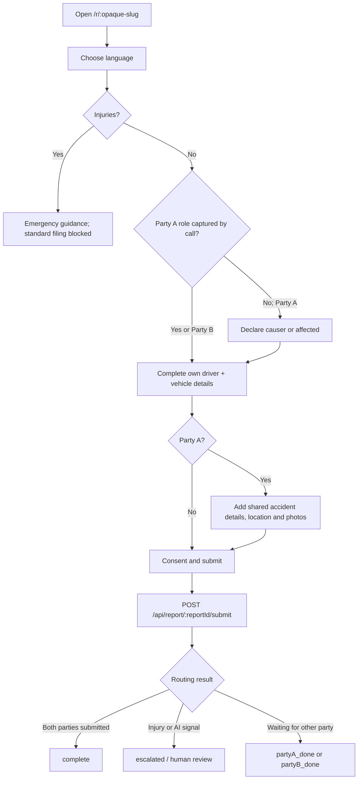

# System and report flow

This document describes what happens from a Hamsa call to a completed Najm POC
report. It is intended for engineers, demo operators, and anyone configuring the
voice agent.

## System context

```mermaid
flowchart LR
  Caller["Driver / caller"] <-- "voice call" --> Hamsa["Hamsa voice agent"]
  Hamsa -- "call lifecycle webhooks\n(call.ended contains outcomeResult)" --> Webhook["Najm webhook\nPOST /api/webhook/hamsa"]
  Webhook --> Mapper["Tolerant outcome mapper"]
  Mapper --> Session["Create report + two opaque links"]
  Session --> DB[("SQLite\nreport, link, audit, feed, SMS")]
  Session --> SMS["SMS adapter\nsimulated or Twilio"]
  SMS --> A["Party A link"]
  SMS --> B["Party B link"]
  A --> FormA["Party A web flow"]
  B --> FormB["Party B web flow"]
  FormA --> Submit["Report submit API"]
  FormB --> Submit
  Submit --> DB
  DB --> Phone["/phone live demo"]
  DB --> Dashboard["/dashboard/:reportId"]
```



## Call-to-link lifecycle

```mermaid
sequenceDiagram
  participant H as Hamsa
  participant N as Najm webhook
  participant D as SQLite
  participant S as SMS adapter
  participant P as /phone

  H->>N: call.started / call.answered / transcription.update
  N->>D: Store each event in the feed
  P->>N: Poll GET /api/feed
  N-->>P: Show live call activity
  H->>N: call.ended + outcomeResult
  N->>D: Check callId for prior mint
  alt First delivery of this callId
    N->>N: Map captured values to Party A, Party B and intake
    N->>D: Create report, two links, audit row and feed event
    N->>S: Send Party A link; send Party B link if mobile captured
    S->>D: Store delivery outcome
    N-->>H: 201 reportId, links, expiry, SMS results
  else Retry of the same callId
    N-->>H: Existing report and links (idempotent)
  end
```

### Webhook rules

- The endpoint is `POST /api/webhook/hamsa`.
- When `HAMSA_WEBHOOK_SECRET` is set, it requires `Authorization: Bearer <secret>`.
- Every valid-looking event is recorded. Only `call.ended` creates a report.
- The mapper accepts the documented field-name synonyms and ignores unfamiliar
  keys without failing the webhook. Ignored keys are returned in the response and
  shown in the feed payload to make agent configuration gaps visible.
- `call.ended` is idempotent by `callId`: retries return the original links rather
  than creating duplicate reports.
- Each report has one Party A link and one Party B link. The links are opaque,
  carry no PII, and expire after 24 hours by default.

## Party completion lifecycle



Party A owns the shared accident section; both parties fill only their own
driver/vehicle section. Submission records consent and an audit event. If the
other party's number becomes available only at submission time, the app sends
that party's link then (provided it has not already sent one).

## Operational surfaces

| Surface | Use it for |
|---|---|
| `/phone` | Live demonstration: webhook feed and simulated SMS phone frames. Open it before a call. |
| `/r/<slug>` | The actual driver-facing flow reached from an opaque link. |
| `/dashboard/<reportId>` | Report status, flags, parties, AI analysis, and audit trail. |
| `http://localhost:4040` | ngrok request inspector when the tunnel is running. |

## Data and safety boundaries

- SQLite is local POC storage in `data/najm.db`; it is recreated after a reset.
- Raw webhook envelopes are deliberately retained in the live feed for debugging.
  Do not treat this as a production retention policy; redact/prune call and
  transcript data before any real deployment.
- Photo analysis is assistive only. Its signals can escalate a report but never
  determine fault.
- Real registry lookup is currently a development stub and must be replaced before
  a production integration.

For the exact fields Hamsa should extract, see [Hamsa webhook integration](hamsa.md).
For an end-to-end setup that can be handed to a demo operator, see
[Run locally with ngrok and Hamsa](run-local-hamsa.md).
